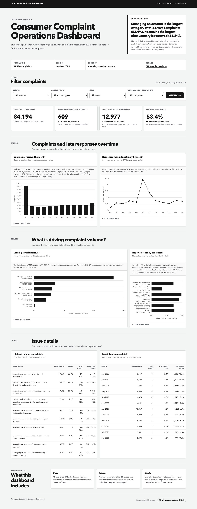
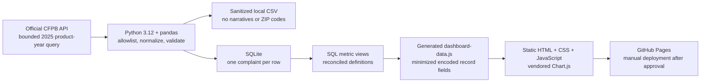

# Consumer Complaint Operations Dashboard

An independent portfolio project that turns official CFPB complaint records
into a dashboard for deciding what an operations analyst should review first.

The project is deliberately small: one reproducible Python pipeline, one
SQLite database, one set of SQL metric views, and one static dashboard. The
delivery evidence—business case, requirements, quality controls, tests,
limitations, and handoff—is part of the product.

> This is an independent personal portfolio project. The CFPB and the
> companies represented in the data did not commission, sponsor, review, or
> endorse it.

**[Open the live dashboard](https://duckky153.github.io/consumer-complaint-operations/)**
·
**[View the quality workflow](https://github.com/Duckky153/consumer-complaint-operations/actions/workflows/ci.yml)**



## Business decision

**Intended user:** a financial-services risk or operations analyst deciding
which public complaint patterns deserve a closer internal review.

**Question:** which complaint categories and responses marked not timely should
be checked first against internal operating data?

The default view shows published volume, response exceptions, reported-relief
response mix, issue concentration, and a sensitivity analysis of the January
spike. Filters narrow the same definitions by month, account type, issue, or
company.

This is an external discovery tool—not an internal case-management, staffing,
service-level, or company-performance dashboard.

## Data boundary

The pipeline uses all **84,194** complaints in the CFPB API snapshot that:

- were received from 2025-01-01 through 2025-12-31; and
- were classified as `Checking or savings account`.

It is a complete bounded product-year population in the published database,
not a random sample. Consumer narratives, ZIP codes, state, tags, submission
channel, and company public-response prose are excluded during ingestion.
Complaint IDs are used only for local uniqueness checks and never enter the
public dashboard.

## Verified default-view findings

- `Managing an account` accounts for **44,959 complaints (53.4%)**.
- Its two largest sub-issues—deposits/withdrawals and debit/ATM-card
  problems—account for **27,171 complaints (32.3%)** and remain a robust first
  investigation lane after excluding January.
- **609 complaints (0.72%)** are marked not timely. June contains 135; one
  source company label accounts for 96 of those exceptions, which is a
  validation lead rather than a performance ranking.
- **12,977 responses (15.41%)** are categorized as closed with monetary or
  non-monetary relief. That is response mix, not proof of success or fault.
- January contains **18,367 complaints**, but two company-issue clusters
  contribute **11,444 (62.3%)**. Without those clusters, January falls to
  **6,923**, or **1.14×** the other-month median.

These are external complaint and response indicators. They do not measure a
company's complete case inventory, staffing demand, defect rate, or consumer
harm because internal denominators and workflow outcomes are unavailable.

## Architecture



There is no application server, account system, cloud database, or runtime API.
The public site is a read-only snapshot.

## Reproduce locally

Requirements:

- Python 3.12
- Node.js only for the JavaScript syntax check
- SQLite 3 for optional command-line inspection

```bash
python3.12 -m venv .venv
.venv/bin/pip install -e '.[dev]'
.venv/bin/python scripts/build_dashboard.py
.venv/bin/pytest
node --check docs/app.js
node --check docs/dashboard-data.js
npm ci
npx playwright install chromium
npm run test:browser
```

Then double-click [`docs/index.html`](docs/index.html). Metrics, charts, and all
four filters work directly in Chrome without a local server.

To mirror GitHub Pages locally, serving the same files over HTTP remains
optional:

```bash
python3.12 -m http.server 8000 --directory docs
```

Then open `http://localhost:8000`.

The live pipeline fetches the exact query in
[`config/pipeline.json`](config/pipeline.json), writes a sanitized local CSV,
creates SQLite views from [`sql/metrics.sql`](sql/metrics.sql), and regenerates
[`docs/dashboard-data.js`](docs/dashboard-data.js). The generated file assigns
the minimized snapshot to a browser variable before the application starts;
there is no runtime data request.

To run the pipeline without network access, pass a CFPB-format CSV:

```bash
.venv/bin/python scripts/build_dashboard.py --source tests/fixtures/complaints.csv
```

## Delivery record

- [Business case and intended user](delivery/business-case.md)
- [Six requirements and acceptance criteria](delivery/requirements.md)
- [Process and data-flow diagrams](delivery/architecture.md)
- [Methodology and analytical limitations](delivery/methodology.md)
- [Data quality, privacy, and security](delivery/security-privacy.md)
- [Executive findings and recommendations](delivery/findings.md)
- [Test traceability](delivery/test-traceability.md)
- [AI-assistance disclosure](delivery/ai-assistance.md)
- [Local delivery evidence](delivery/delivery-evidence.md)
- [Two-minute demo](delivery/demo-script.md)

## Engineering approach

The dashboard itself is reserved for analysis and decisions. Build hashes,
test counts, project-provenance notices, and other verification metadata stay
in this repository's documentation and evidence files.

## License and source rights

Project code and original documentation are MIT licensed. The CFPB source data
is published under CC0. Chart.js 4.5.1 is vendored under its MIT license; see
[`THIRD_PARTY_NOTICES.md`](THIRD_PARTY_NOTICES.md).

## Salesforce Tableau extension — local delivery

The supporting Tableau project for Salesforce JR358388 now includes **Overview** and **Investigation** dashboards, five shared cohort controls, both January sensitivity modes and repeatable reset. The original web dashboard remains unchanged.

Open [Consumer Complaint Operations.twbx](tableau/Consumer%20Complaint%20Operations.twbx) locally in Tableau. The [editable TWB](tableau/Consumer%20Complaint%20Operations.twb) uses the companion generated Hyper. The package includes its own Hyper and was reopened independently in native Tableau.

Start with the [walkthrough](delivery/TABLEAU-WALKTHROUGH.md), [manual rebuild guide](delivery/TABLEAU-REBUILD-GUIDE.md), [architecture](delivery/TABLEAU-ARCHITECTURE.md) and [current build/evidence record](delivery/BUILD-STATE.md). This is AI-assisted portfolio work; personal rehearsal is separate.

26 automated tests pass; 11 packaged-data/source-SQL scopes and full row multiplicities reconcile. Native filters, sensitivity, cross-page scope, reset and edge states are recorded in [native evidence](evidence/native-tableau-verification.json). No new publication or GitHub push has occurred.

```sh
uv sync --locked --extra dev
uv run --locked python -m complaint_ops.tableau
uv run --locked python -m complaint_ops.hyper
uv run --locked python -m complaint_ops.workbook
uv run --locked python scripts/verify_tableau.py
uv run --locked pytest -q
```

The pinned source must already be present locally. The [September19 readiness review](delivery/2026-09-19-ROLE-READINESS-REVIEW.md) records the pre-build gaps; BUILD-STATE is the current status.
