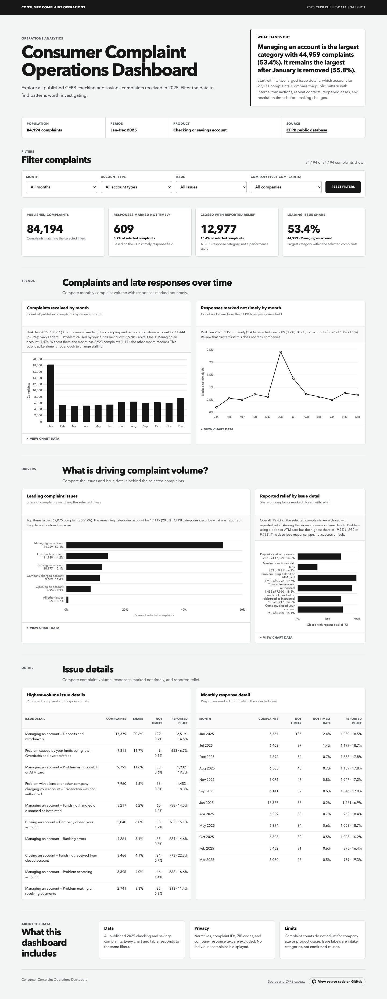
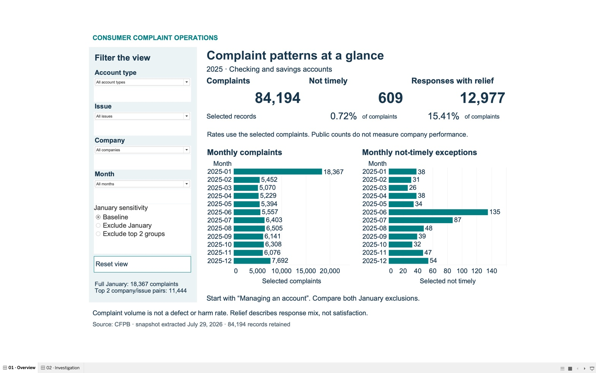
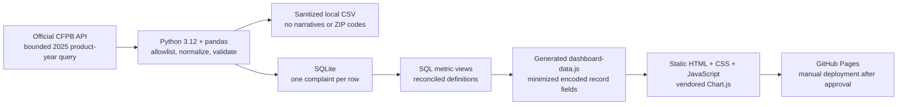

# Consumer Complaint Operations Dashboard

This project turns 84,194 public CFPB complaints about checking and savings
accounts into a dashboard that shows where complaints cluster and which
responses were marked not timely. It helps a bank risk or operations analyst
decide which complaint patterns to check first against internal data.

**[Open the live dashboard](https://duckky153.github.io/consumer-complaint-operations/)**
·
**[Tableau version](https://github.com/Duckky153/consumer-complaint-operations/releases/tag/tableau-2026-09-19)**
·
**[View the quality workflow](https://github.com/Duckky153/consumer-complaint-operations/actions/workflows/ci.yml)**



- **84,194 complaints:** every published 2025 CFPB complaint about checking or
  savings accounts in one pinned snapshot, not a sample.
- **One issue leads:** `Managing an account` has 44,959 complaints (53.4%).
- **January spike explained:** two company and issue pairs account for 11,444
  of January's 18,367 complaints. Without them, January has 6,923.
- **Checked:** 26 automated tests, 20 delivery checks, and 11 comparisons
  between source SQL and the packaged Tableau data pass.

Built with AI assistance (OpenAI Codex). See the
[AI-assistance disclosure](delivery/ai-assistance.md).

> This is an independent personal project. The CFPB and the companies
> represented in the data did not commission, sponsor, review, or endorse it.

The project is deliberately small: one Python pipeline, one SQLite database,
one set of SQL metric views, and one static dashboard. The business case,
requirements, quality controls, tests, limitations, and handoff notes are in
[`delivery/`](delivery/).

## Business decision

**Intended user:** a financial-services risk or operations analyst deciding
which public complaint patterns deserve a closer internal review.

**Question:** which complaint categories and responses marked not timely should
be checked first against internal operating data?

The default view shows published volume, response exceptions, reported-relief
response mix, issue concentration, and a sensitivity analysis of the January
spike. Filters narrow the same definitions by month, account type, issue, or
company.

This is an external discovery tool—not an internal case-management, staffing,
service-level, or company-performance dashboard.

## Data boundary

The pipeline uses all **84,194** complaints in the CFPB API snapshot that:

- were received from 2025-01-01 through 2025-12-31; and
- were classified as `Checking or savings account`.

It is a complete bounded product-year population in the published database,
not a random sample. Consumer narratives, ZIP codes, state, tags, submission
channel, and company public-response prose are excluded during ingestion.
Complaint IDs are used only for local uniqueness checks and never enter the
public dashboard.

## Verified default-view findings

- `Managing an account` accounts for **44,959 complaints (53.4%)**.
- Its two largest sub-issues—deposits/withdrawals and debit/ATM-card
  problems—account for **27,171 complaints (32.3%)** and remain a robust first
  investigation lane after excluding January.
- **609 complaints (0.72%)** are marked not timely. June contains 135; one
  source company label accounts for 96 of those exceptions, which is a
  validation lead rather than a performance ranking.
- **12,977 responses (15.41%)** are categorized as closed with monetary or
  non-monetary relief. That is response mix, not proof of success or fault.
- January contains **18,367 complaints**, but two company-issue clusters
  contribute **11,444 (62.3%)**. Without those clusters, January falls to
  **6,923**, or **1.14×** the other-month median.

These are external complaint and response indicators. They do not measure a
company's complete case inventory, staffing demand, defect rate, or consumer
harm because internal denominators and workflow outcomes are unavailable.

## Tableau version

The same 84,194 complaints are also available as a Tableau workbook with two
dashboards, Overview and Investigation. Five shared controls (account type,
issue, company, month, and January sensitivity) apply to both pages, and one
Reset view control restores all five.



To open it:

1. Download `Consumer.Complaint.Operations.twbx` from the
   [release page](https://github.com/Duckky153/consumer-complaint-operations/releases/tag/tableau-2026-09-19),
   or use [`tableau/Consumer Complaint Operations.twbx`](<tableau/Consumer Complaint Operations.twbx>)
   from this repository.
2. Install the free Tableau Desktop Public Edition (Tableau Public).
3. Open the `.twbx` file with File > Open. The data is packaged inside the
   file, so it needs no data connection or Tableau account for local use.

The workbook uses a ten-field extract with no complaint IDs or narratives. Its
packaged data matches source SQL in 11 checks. Native checks in Tableau Public
2026.2.2 (filters, both January modes, cross-page state, reset, and small,
empty and Unknown groups) are recorded with 15 screenshots in
[`evidence/native-tableau-readability-verification.json`](evidence/native-tableau-readability-verification.json).

More detail: [walkthrough](delivery/TABLEAU-WALKTHROUGH.md),
[manual rebuild guide](delivery/TABLEAU-REBUILD-GUIDE.md),
[architecture](delivery/TABLEAU-ARCHITECTURE.md),
[field dictionary](delivery/TABLEAU-DATA-DICTIONARY.md), and
[build record](delivery/BUILD-STATE.md).

## Architecture


```mermaid
flowchart LR
    A["Official CFPB API<br>bounded 2025 product-year query"] --> B["Python 3.12 + pandas<br>allowlist, normalize, validate"]
    B --> C["Sanitized local CSV<br>no narratives or ZIP codes"]
    B --> D["SQLite<br>one complaint per row"]
    D --> E["SQL metric views<br>reconciled definitions"]
    E --> F["Generated dashboard-data.js<br>minimized encoded record fields"]
    F --> G["Static HTML + CSS + JavaScript<br>vendored Chart.js"]
    G --> H["GitHub Pages<br>manual deployment after approval"]
```

There is no application server, account system, cloud database, or runtime API.
The public site is a read-only snapshot.

## Reproduce locally

Requirements:

- Python 3.12
- Node.js for the JavaScript syntax and browser checks
- SQLite 3 for optional command-line inspection

```bash
python3.12 -m venv .venv
.venv/bin/pip install -e '.[dev]'
.venv/bin/python scripts/build_dashboard.py
.venv/bin/pytest
.venv/bin/python scripts/verify_delivery.py
node --check docs/app.js
node --check docs/dashboard-data.js
npm ci
npx playwright install chromium
npm run test:browser
```

With [uv](https://docs.astral.sh/uv/), run `uv sync --locked --extra dev` and
prefix the Python commands with `uv run --locked` instead.

Then double-click [`docs/index.html`](docs/index.html). Metrics, charts, and all
four filters work directly in Chrome without a local server.

To mirror GitHub Pages locally, serving the same files over HTTP remains
optional:

```bash
python3.12 -m http.server 8000 --directory docs
```

Then open `http://localhost:8000`.

The live pipeline fetches the exact query in
[`config/pipeline.json`](config/pipeline.json), writes a sanitized local CSV,
creates SQLite views from [`sql/metrics.sql`](sql/metrics.sql), and regenerates
[`docs/dashboard-data.js`](docs/dashboard-data.js). The generated file assigns
the minimized snapshot to a browser variable before the application starts;
there is no runtime data request.

To run the pipeline without network access, pass a CFPB-format CSV:

```bash
.venv/bin/python scripts/build_dashboard.py --source tests/fixtures/complaints.csv
```

### Rebuild the Tableau files

The Tableau steps read the pinned source CSV at
`data/raw/complaints_2025_checking_savings.csv` (SHA-256
`964912efdcfe70f2376591d40781f64832e879c73ff7d629fdadb6115541053b`). That file
is not stored in Git. A new live fetch can differ from the pinned snapshot,
because the CFPB can correct or remove records, so these steps stop when the
hash does not match.

```bash
.venv/bin/python -m complaint_ops.tableau
.venv/bin/python -m complaint_ops.hyper
.venv/bin/python -m complaint_ops.workbook
.venv/bin/python scripts/verify_tableau.py
```

Rebuilt workbook files can differ byte for byte from the released workbook, so
a new release needs new native Tableau checks.

## Delivery record

- [Business case and intended user](delivery/business-case.md)
- [Six requirements and acceptance criteria](delivery/requirements.md)
- [Process and data-flow diagrams](delivery/architecture.md)
- [Methodology and analytical limitations](delivery/methodology.md)
- [Data quality, privacy, and security](delivery/security-privacy.md)
- [Executive findings and recommendations](delivery/findings.md)
- [Test traceability](delivery/test-traceability.md)
- [AI-assistance disclosure](delivery/ai-assistance.md)
- [Local delivery evidence](delivery/delivery-evidence.md)
- [Two-minute demo](delivery/demo-script.md)

## Engineering approach

The dashboard itself is reserved for analysis and decisions. Build hashes,
test counts, project-provenance notices, and other verification metadata stay
in this repository's documentation and evidence files.

## License and source rights

Project code and original documentation are MIT licensed. The CFPB source data
is published under CC0. Chart.js 4.5.1 is vendored under its MIT license; see
[`THIRD_PARTY_NOTICES.md`](THIRD_PARTY_NOTICES.md).
