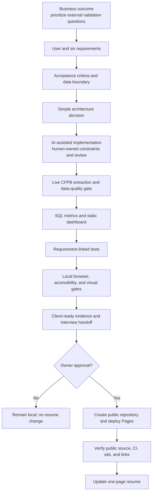
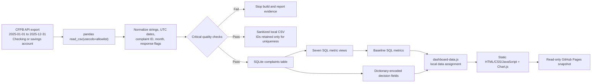

# Delivery Process and Architecture

## Delivery process

## Data flow

## Deliberate architecture choices

| Decision | Choice | Why |
|---|---|---|
| Data scope | One complete product-year population | Coherent external-signal domain and twelve months of movement without arbitrary sampling |
| Data processing | Python 3.12 and pandas | Inspectable transformation with a small dependency surface |
| Metric store | SQLite and checked-in SQL views | Portable, auditable metrics without a cloud database |
| Public surface | Static HTML, CSS, JavaScript, Chart.js | Responsive, directly openable from disk, and deployable to GitHub Pages without a backend |
| Data loading | Generated local JavaScript data asset before app startup | Avoids a runtime API and the browser restriction on fetching sibling files from `file://` pages |
| Visual language | Restrained black-and-white operations interface | Prioritizes scanning, comparison, and professional credibility over editorial styling |
| Chart dependency | Vendored Chart.js 4.5.1 | No runtime CDN request; pinned code and license |
| Interaction | Four global filters | Enough exploration for the operating question without a dense BI control panel |
| Privacy | Field allowlist and minimized encoded browser records | Public source does not mean every source field is necessary to republish |
| AI use | Assisted implementation with explicit disclosure | Faster execution with human-owned scope, constraints, validation, and accountability |

## Why there is no backend

The dashboard is a public analytical snapshot. It does not collect data,
manage users, write decisions, or require a live database. A backend would add
deployment, security, cost, and maintenance obligations without improving the
portfolio decision. The Python build is the controlled data plane; the browser
is the read-only presentation plane.

## Public sources informing the controls

These public sources influenced the delivery choices. This is not a claim that
the project follows a formal or proprietary Deloitte methodology.

- Deloitte on requirements, user expectations, robustness, reliability,
  efficiency, simplicity, security, and dependability:
  https://www.deloitte.com/us/en/insights/industry/technology/how-can-organizations-develop-quality-software-in-age-of-gen-ai.html
- Deloitte on business value, human stewardship, guardrails, auditability, and
  evidence-backed oversight:
  https://www.deloitte.com/us/en/services/consulting/articles/future-of-software-engineering.html
- Deloitte on human ownership of architecture, validation, quality, and
  accountability in AI-assisted engineering:
  https://www.deloitte.com/us/en/services/consulting/articles/agentic-ai-impact-on-software-engineering.html
- Deloitte on lifecycle gates, validation, privacy, security, and audit-ready
  AI risk evidence:
  https://www.deloitte.com/us/en/services/consulting/services/ai-risk-governance-program.html
- CFPB database scope and limitations:
  https://www.consumerfinance.gov/data-research/consumer-complaints/
- CFPB field definitions and privacy treatment:
  https://www.consumerfinance.gov/complaint/data-use/
